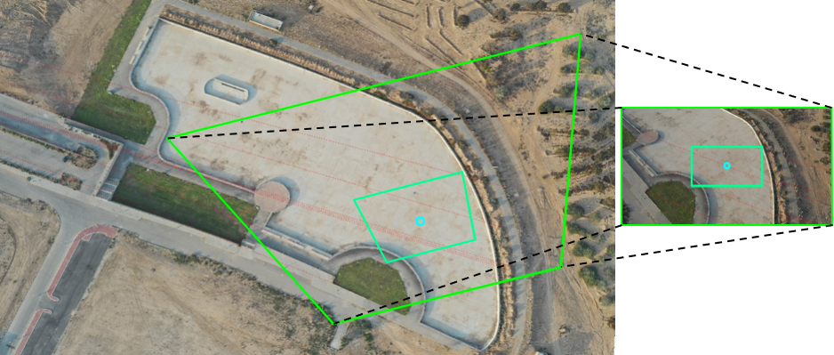
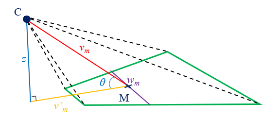
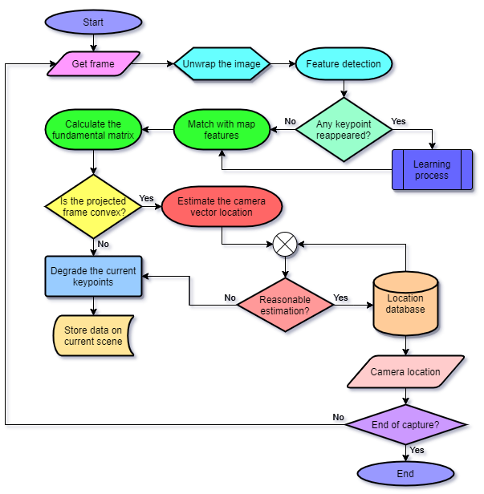
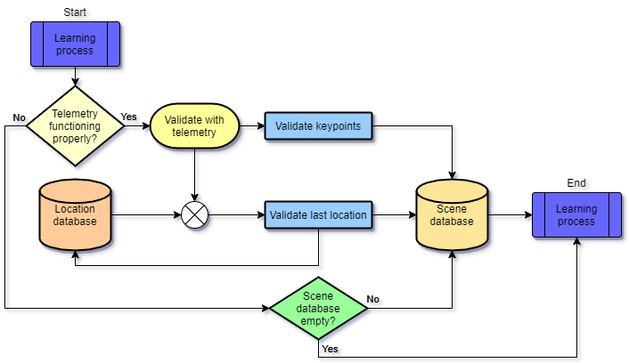

# Localization of UAVs Using Image Processing

Unmanned aerial vehicles (UAVs) are widely used nowadays for photography, surveillance, mapping and research purposes. These aircrafts control relies on monitoring their location by constantly combining accelerometers (INS) with satellite communication (GPS). The latter is usually referred to as localization. Alas, a UAV navigation system that relies on GPS is vulnerable to signal failure or initiated interruptions. In this thesis we propose a new approach to use the camera installed on the device for localization purposes, such that it could be used as an alternative when the satellite navigation system malfunctions, and/or be easily incorporated into a sensor fusion framework.

We present a vision-based localization method that finds the location of a camera by first comparing the observed image to an orthophoto map and then, using simple geometric approach to localize the camera. The method includes projecting the outer shape of the observed frame onto the map image plane using the fundamental matrix. Then, the camera geolocation is obtained from a simple geometric relation with the frame shape.

This thesis includes a background overview in image processing, and a mathematical analysis of the problem that the project intends to solve. Furthermore, the proposed solution is presented followed by a preliminary simulation which compares our first results to other well-known methods. Then, a description of the algorithm that was used to implement our method is presented, including flowcharts and explanation on its various phases.

Finally, experiments were performed with a real drone to check the accuracy of the method in various terrains and flight modes affecting the camera viewpoint. After presenting the improvements made to the algorithm with experiment substantiations, we performed more tests to examine the effects of altitude, angle of view and more attributes of the capturing camera, on the accuracy of the proposed method. The results show that the method’s uncertainty in evaluating the drone’s location is less than 10 meters. Furthermore, our solution error remains within the same scale despite the change in altitude and camera pitch angle.

The following repository include files relating to a project done within M.Sc studies in robotics engineering.

**Tal Raveh**

## Main Goal
The main goal of the project is to enable an UAV to identify its location with the camera mounted on it. To do so, a system has been developed; this system capable of localizing the aircraft by processing the image obtained from the camera. The system compares the image with a given orthophoto map and estimates the shape of the frame on the map. Then, we propose a geometric relation between the frame shape and the camera geolocation.

## Location Out of Frame Shape
The method presented here was generated to find a relation between an observation point above ground level and the shape of its image projected on the map. Due to the need of using the algorithm on the video output of the drone, a fast and simple geometric solution is proposed here.

First, the system compares the camera frame image with the orthophoto map and match enough correspondences to get the fundamental matrix linking the two images. Then, by projecting the four corners of the frame to the map image, we can estimate the shape of the frame on the map. The following figure shows an example of projecting the frame shape with the use of the fundamental matrix.

Considering the related work on the P3P problem and more pose estimation suggestions in literature, we proposed a relation between the camera geolocation and the shape of the frame projected on the map image using as few parameters as possible. The following figure presents the problem including: the width wm of the projected frame passes its mid-point; the height z of the camera above the mid-point ground level (AGL); the distance vm between the camera and the center of the projected frame, its projection v’m on the horizontal plane which contains the center of the frame and the angle with the horizon θ.

## Implementation of the Solution

The algorithm solution consists of three major phases; first, it corrects the distorted frame and detects keypoints using ORB detector. Second, it matches the observed features with the ones detected on the map and calculates the fundamental matrix linking the frame and the map images. Finally, it estimates the camera location using the frame-shape method presented earlier. The flowchart presented in the next figure describes the sequence of actions involved in the implementation of the solution.

In case the currently captured frame is not the first image from the scene, after the first phase the algorithm match the observed POIs (Points of Interest) with the information stored in the scene database. If any POI reappeared, a learning process is initiated through which the system could optimize the POIs it uses for further calculations. The following figure shows the learning process which uses additional telemetry data from the drone functioning sensors.

## Experiment results

